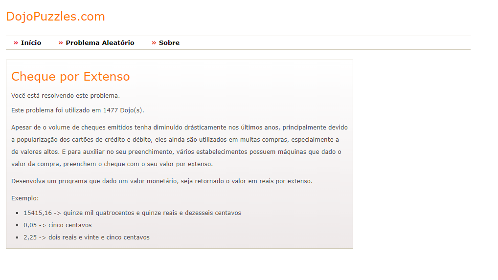

<h1 align="center"> Desafio: Dojo Cheque por Extenso</h1>

### :hammer_and_wrench: Tecnologias

As seguintes tecnologias e ferramentas foram utilizadas neste projeto: `Typescript e Jest`

### :gear: Como utilizar

Para visualizar os testes, é preciso seguir o passo a passo abaixo:


```bash
# Baixe este repositório ou clone pelo Git usando o comando:
$ git clone https://github.com/ThHenrique/fa-software-quality-and-testing.git

# Acesse a pasta do projeto
$ cd fa-software-quality-and-testing/tdd

# instale as dependencias
$ yarn install

# Inicie os testes
$ yarn test

# Verifique a cobertura de testes
$ yarn test:coverage
```

Desafio selecionado imagem:



O exemplo citado acima foi utilizado como parâmetro em alguns testes.


### Cobertura de teste

File                    | % Stmts | % Branch | % Funcs | % Lines | Uncovered Line #s
------------------------|---------|----------|---------|---------|-------------------
All files               |   98.57 |    95.55 |     100 |   98.52 |
 classes/check          |     100 |      100 |     100 |     100 |
  check.ts              |     100 |      100 |     100 |     100 |
 constants              |     100 |      100 |     100 |     100 |
  numberInWords.ts      |     100 |      100 |     100 |     100 |
 utils/NumberInWords    |   97.56 |    94.59 |     100 |    97.5 |
  NumberInWords.util.ts |   97.56 |    94.59 |     100 |    97.5 | 70
